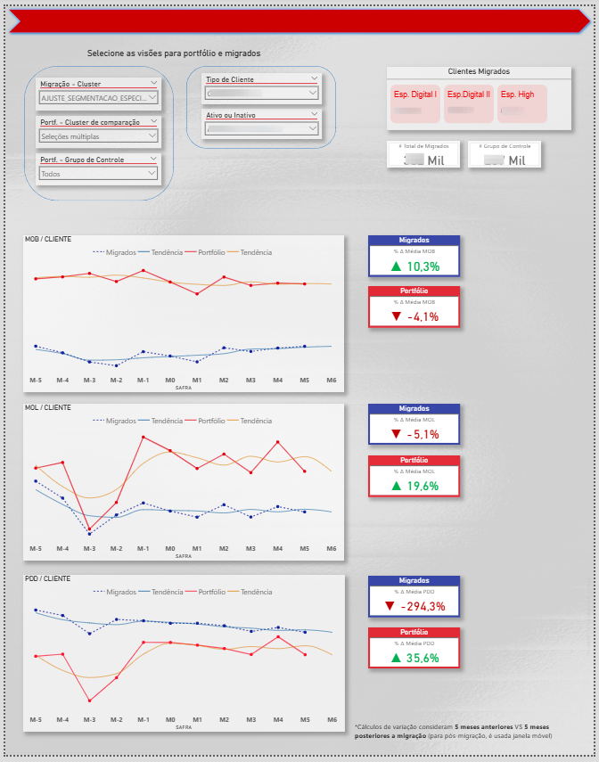
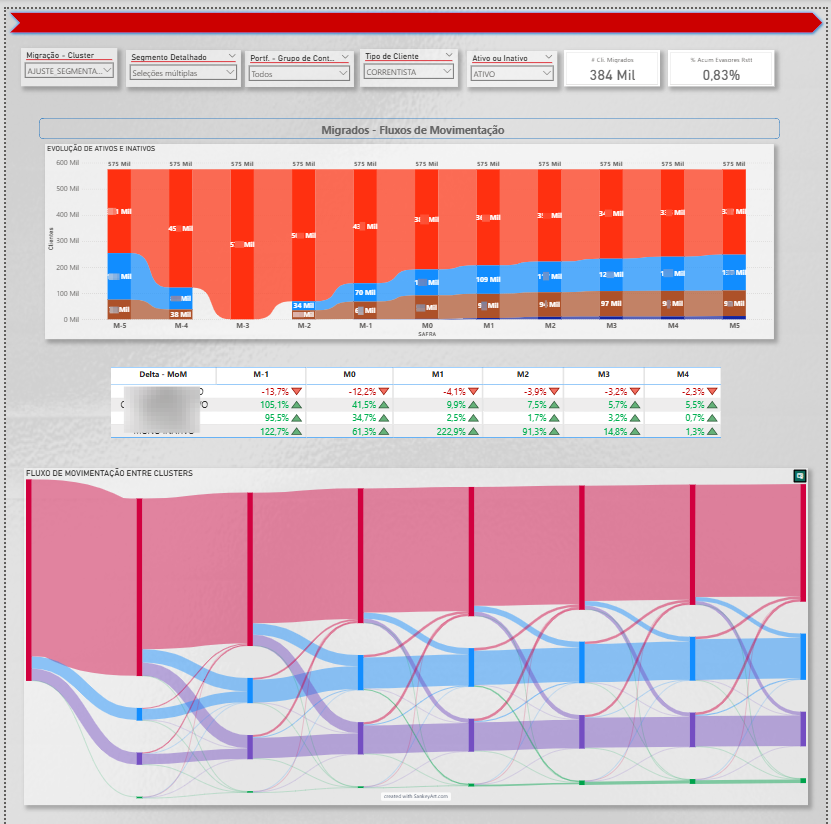
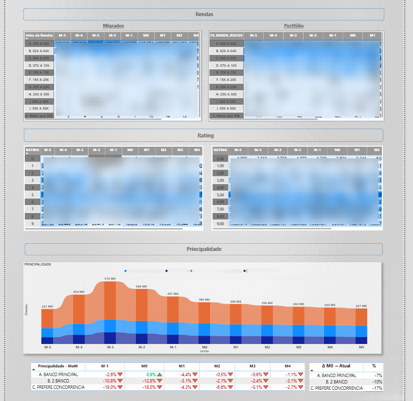
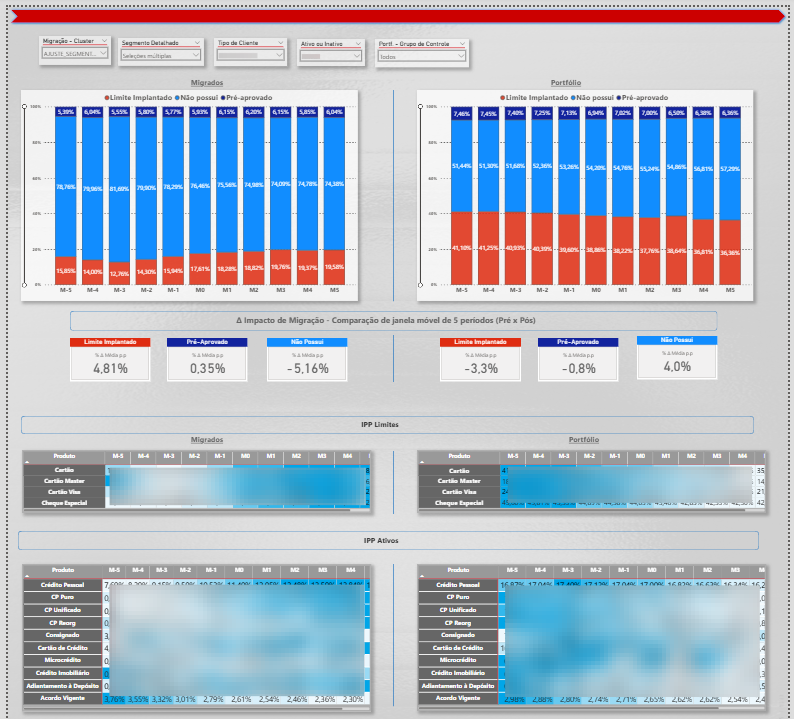
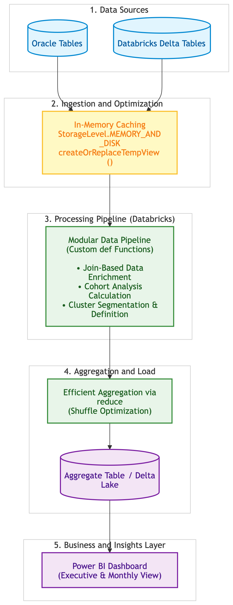

# Customer Migration & Cohort Analysis Pipeline

## Business Problem & Context

Annual customer segmentation migrations—driven by criteria such as credit rating, investment balance, product adoption, and income bracket—aim to maximize customer activation, product penetration, and overall profitability.

**The Key Question**: Are these strategic segment migrations actually delivering the expected financial and behavioral uplift over time?

To answer this, this pipeline ingests, cleans, clusters, and manipulates multiple large-scale datasets, processing a portfolio of over 70 million customer records using Big Data engineering techniques in PySpark.

---

## 📊 Dashboard & Visual Insights

> **Note:** Screenshots display masked/anonymized data for compliance and portfolio purposes.

### Overview: Profiability 

Vintage Financial Performance & Profitability Dashboard (Migrated vs. Control Group)
Executive dashboard designed to analyze vintage profitability trends and key banking performance indicators (KPIs). The solution measures the financial trajectory of migrated clients against a baseline control group across a dynamic time window (pre- and post-migration, M-5 to M6).

#### Key Features:
>**Cohort & Banking KPI Analysis**:  Vintage tracking for credit and profitability metrics (MOB/Client, MOL/Client, and PDD/Client) featuring average growth rate variations (%ΔAvg MO0).

>**Dynamic Data Granularity**:  Multi-variable slicers allowing drill-down analysis by migration clusters, client categories, account status (Active/Inactive), and custom control portfolios.

>**Performance Impact Measurement**:  Quantitative evaluation contrasting migrated client adoption and uplift against control portfolio baseline trends.

### Cohort Evolution & Financial Metrics
 
Client Migration Flow & Volume Dynamics Dashboard
Executive analytical view designed to map customer migration patterns, activity status shifts, and cluster transition flows over time. The solution evaluates monthly active/inactive volume movement and customer distribution across income brackets relative to the baseline portfolio.

 

#### Key Features:
> **Customer Movement & Cluster Flow Tracking:**

>Integrated visual mapping combining stacked volume evolution with a Sankey-style movement diagram to trace customer transition paths across active/inactive categories and clusters from moment M-5 through M5.

>**Month-over-Month (MoM) Delta Dynamics:**

>Granular MoM matrix highlighting month-to-month percentage changes and status shifts across key segments (Correntista Ativo, Correntista Inativo, Mono Ativo, Mono Inativo).

>**Income Bracket Distribution & Portfolio Comparison:**

>Comparative side-by-side matrices contrasting migrated customer income tiers against baseline portfolio distributions to assess value-bracket retention and churn risk.
---

### Pipeline Highlights
1. **In-Memory Caching with Disk Fallback**: Utilizes StorageLevel.MEMORY_AND_DISK persistence to prevent redundant DAG re-computations across multiple downstream actions while avoiding Out-Of-Memory (OOM) errors.
2. **Map-Side Aggregation (reduce)**: Applies associative reduce operations to perform local partition pre-aggregation, drastically minimizing network shuffle overhead and I/O latency.
3. **Incremental Processing:** Skips previously processed `ANOMES_REF` keys to optimize compute resource utilization.
4. **Cohort Framing:** Generates dynamic monthly windows (M-5 to M+5) relative to the migration event (M0).
5. **Multi-Source Ingestion:** Blends Delta Lake tables with direct partitioned Oracle SQL fetches.
6. **Behavioral Analytics:** Computes Product Penetration Index (IPP), PDD (loan loss provisions), Operating Margins (MOB/MOL), and cluster dynamics using PySpark Window Functions.
7. **Control Group Benchmarking:** Isolates migrated clients to build an un-migrated baseline comparison base.

---

## 🛠️ Data Architecture & Flow

